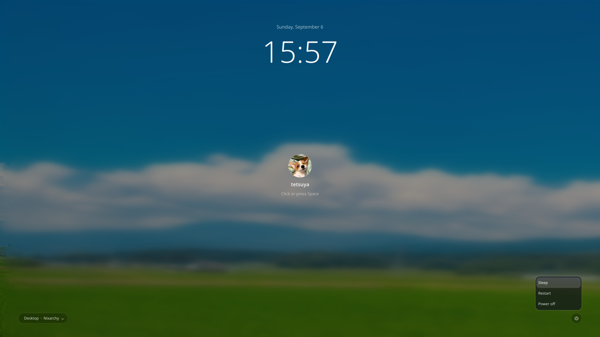

# Shizuka



## English

Shizuka is a quiet, Nixarchy-inspired SDDM login theme. Its visual design is
kept in one-to-one correspondence with the `iamcheyan.lock-screen` Quickshell
plugin: the same background treatment, clock, avatar, username, password area,
spacing, typography, and bottom controls are used in both interfaces.

This is an SDDM greeter theme, not a lock daemon. It uses SDDM's native user,
session, and authentication APIs and does not replace the system lock service.

### Features

- Current Nixarchy background from `~/.local/state/omarchy/current/background`.
- Blurred wallpaper with a dark translucent overlay.
- Centered clock, avatar, username, password entry, and submit control.
- Session selection and power options styled to match the theme.
- Space and Enter focus the password field from any menu or control.

### Installation with NixOS

Package this directory as an SDDM theme in your NixOS configuration, then enable it:

```nix
services.displayManager.defaultSession = "omarchy";

services.displayManager.sddm = {
  enable = true;
  wayland.enable = true;
  theme = "shizuka";
};
```

The theme itself does not modify the system configuration. SDDM must be able to
read the configured background and avatar files.

### Preview

From this directory, run:

```bash
./preview.sh
```

The preview uses SDDM test mode and does not start the real SDDM service or
affect the current login session. Authentication is not completed in test mode.

### Keeping the lock screen and login theme consistent

The visual source files are:

- `Main.qml` — SDDM login theme.
- `~/.config/omarchy/plugins/iamcheyan.lock-screen/LockView.qml` — Quickshell lock screen.

Whenever the visual design changes, update and test both files together.
Authentication, user models, session models, and system actions may use
environment-specific APIs, but shared visual parameters must remain aligned.

## 中文


Shizuka 是一个安静、简洁的 Nixarchy 风格 SDDM 登录主题。它与
`iamcheyan.lock-screen` Quickshell 锁屏插件保持一一对应：背景处理、时间、
头像、用户名、密码区域、间距、字体以及底部操作控件都使用同一套视觉规范。

这是 SDDM 登录界面主题，不是锁屏守护进程。它使用 SDDM 原生的用户、会话和
认证接口，不会替换系统原有的锁屏服务。

### 功能

- 使用 `~/.local/state/omarchy/current/background` 中的 Nixarchy 当前壁纸；
- 壁纸模糊和暗色半透明遮罩；
- 居中的时间、头像、用户名、密码输入和提交控件；
- 与主题一致的会话选择和电源选项；
- 无论焦点在菜单还是其他控件上，按空格或回车都会进入密码输入框。

### NixOS 安装

将此目录作为 SDDM 主题包加入 NixOS 配置，然后启用：

```nix
services.displayManager.defaultSession = "omarchy";

services.displayManager.sddm = {
  enable = true;
  wayland.enable = true;
  theme = "shizuka";
};
```

主题本身不会修改系统配置。SDDM 必须能够读取配置中的壁纸和头像文件。

### 预览

在项目目录运行：

```bash
./preview.sh
```

预览使用 SDDM 测试模式，不会启动真正的 SDDM 服务，也不会影响当前登录会话。
测试模式不会真正完成认证。

### 锁屏与登录主题的一致性

对应的视觉源文件是：

- `Main.qml`：SDDM 登录主题；
- `~/.config/omarchy/plugins/iamcheyan.lock-screen/LockView.qml`：Quickshell 锁屏。

以后修改视觉设计时，必须同时修改并测试这两个文件。认证、用户模型、会话模型
和系统操作可以根据运行环境使用不同接口，但共享视觉参数必须保持一致。

## 日本語


Shizuka は、静かでシンプルな Nixarchy スタイルの SDDM ログインテーマです。
`iamcheyan.lock-screen` Quickshell ロック画面プラグインと一対一で対応しており、
背景処理、時計、アバター、ユーザー名、パスワード欄、間隔、フォント、下部の操作
コントロールに同じビジュアル仕様を使用します。

これは SDDM のログイン画面テーマであり、ロックデーモンではありません。SDDM の
標準ユーザー、セッション、認証 API を使用し、システムのロックサービスは置き換えません。

### 機能

- `~/.local/state/omarchy/current/background` の Nixarchy 現在壁紙を使用；
- 壁紙のぼかしと暗い半透明オーバーレイ；
- 中央の時計、アバター、ユーザー名、パスワード入力、送信コントロール；
- テーマに合わせたセッション選択と電源オプション；
- メニューや他のコントロールにフォーカスがあっても、Space または Enter でパスワード欄へ移動。

### NixOS へのインストール

このディレクトリを SDDM テーマとして NixOS 設定にパッケージし、次のように有効化します。

```nix
services.displayManager.defaultSession = "omarchy";

services.displayManager.sddm = {
  enable = true;
  wayland.enable = true;
  theme = "shizuka";
};
```

テーマ自体はシステム設定を変更しません。SDDM が設定された壁紙とアバターを読み取れる必要があります。

### プレビュー

プロジェクトディレクトリで実行します。

```bash
./preview.sh
```

プレビューは SDDM のテストモードを使用します。実際の SDDM サービスは起動せず、
現在のログインセッションにも影響しません。テストモードでは認証は完了しません。

### ロック画面とログインテーマの整合性

対応するビジュアルのソースファイルは次の二つです。

- `Main.qml`：SDDM ログインテーマ；
- `~/.config/omarchy/plugins/iamcheyan.lock-screen/LockView.qml`：Quickshell ロック画面。

今後ビジュアルを変更するときは、必ず両方のファイルを同時に変更してテストしてください。
認証、ユーザーモデル、セッションモデル、システム操作は環境ごとに異なる API を使用できますが、
共有するビジュアルパラメータは一致させてください。
